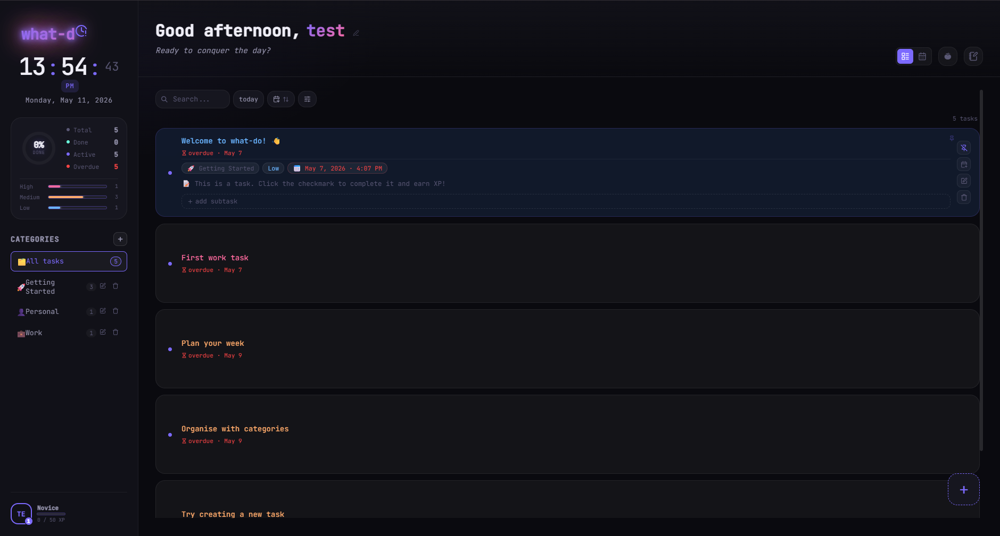

# what-do 📋

> A sleek, full-stack productivity app built for people who actually want to get things done.



**Live demo → [what-do.onrender.com](https://what-do.onrender.com)**

---

## Features

- **Task management** — create, complete, pin, and delete tasks with due dates and descriptions
- **Priorities** — mark tasks as low, medium, high, or critical priority
- **Categories** — organise tasks into colour-coded categories
- **Sticky notes** — freeform notes board for quick thoughts
- **Calendar view** — see tasks laid out by date
- **Pomodoro timer** — built-in focus timer with XP rewards on session completion
- **Live clock** — real-time clock and date displayed in the sidebar
- **Completion stats** — track total, done, active, and overdue tasks at a glance
- **Task filtering & search** — filter by status, sort by priority or due date, full-text search
- **JWT authentication** — secure login with access + refresh token rotation
- **Session guard** — inactivity warning with auto-logout after idle period
- **Proactive token refresh** — silent token renewal before expiry, no surprise logouts

### Gamification & Progression

what-do has a built-in XP and leveling system that rewards consistent productivity:

- **Earn XP** by completing tasks — base reward plus bonuses for priority level, finishing before the deadline, and daily streaks
- **Level up** to unlock higher limits on tasks, categories, and sticky notes
- **Streak system** — complete tasks on consecutive days to earn bonus XP (capped at 3x)
- **5 levels** of progression, each unlocking more features

| Level | XP Required | Tasks | Categories | Sticky Notes |
|---|---|---|---|---|
| 1 | 0 | 5 | 2 | 0 |
| 2 | 50 | 12 | 3 | 2 |
| 3 | 150 | 25 | 5 | 5 |
| 4 | 350 | Unlimited | Unlimited | Unlimited |
| 5 | 700 | Unlimited | Unlimited | Unlimited |

**XP rewards:**

| Action | XP |
|---|---|
| Complete a task | +10 |
| High priority bonus | +5 |
| Critical priority bonus | +10 |
| Finish before deadline | +5 |
| Daily streak bonus (per day, max 3) | +5 |
| Complete a Pomodoro session | +5 |
| Uncomplete a task | -5 |

---

## Tech Stack

| Layer | Technology |
|---|---|
| Backend | Django 6 + Django REST Framework |
| Auth | SimpleJWT with token rotation & blacklisting |
| Frontend | React 19 + TypeScript + Vite |
| State management | TanStack Query (server state) + Zustand (UI state) |
| Styling | CSS Modules |
| Database | PostgreSQL via Neon (production) · SQLite (local) |
| Deployment | Render (Docker) + Neon (database) |
| Static files | WhiteNoise — Django serves the Vite build directly |

---

## Architecture

Django serves the entire app — the React frontend is built by Vite inside Docker and served as static files through WhiteNoise. No separate frontend service, no CORS issues in production.

```
Browser → Render URL
           └── Docker container
                ├── Gunicorn + Django
                │    ├── WhiteNoise → /static/assets/* (Vite build)
                │    ├── /api/**    → DRF views
                │    └── /*         → index.html (React SPA)
                └── Neon PostgreSQL (external)
```

### State management

Server data (tasks, categories, notes, profile) lives in TanStack Query's cache with optimistic updates and automatic invalidation. UI state (filters, XP, level, streak) lives in Zustand. The two never overlap.

---

## Local Development

### Prerequisites
- Python 3.12+
- Node.js 20+

### Setup

```bash
# 1. Clone
git clone https://github.com/Imtela04/to-do-list-4.0.git
cd to-do-list-4.0

# 2. Python environment
python -m venv venv
venv\Scripts\activate      # Windows
source venv/bin/activate   # Mac/Linux
pip install -r requirements.txt

# 3. Frontend dependencies
cd frontend && npm install && cd ..

# 4. Environment variables
```

Create `to-do-list-4.0/.env`:
```env
SECRET_KEY=your-local-secret-key
DEBUG=True
ALLOWED_HOSTS=localhost,127.0.0.1
```

Create `frontend/.env`:
```env
VITE_API_URL=http://localhost:8000/api
```

```bash
# 5. Database
python manage.py migrate

# 6. Run both servers
python manage.py runserver        # Django on :8000
cd frontend && npm run dev        # Vite on :5173
```

App runs at **http://localhost:5173**

---

## Tests

### Backend — 92 tests

```bash
python manage.py test apps.accounts apps.todo
```

Covers XP calculation and level-up logic, streak tracking and bonus XP, task/category/note limits per level, JWT auth (register, login, token refresh), task CRUD and ownership enforcement, and unauthenticated access rejection.

### Frontend — 28 tests

```bash
cd frontend && npm run test:run
```

Covers TanStack Query hooks (auth gating, error states, paginated responses), optimistic mutation logic (toggle, delete, add task) with rollback on failure, and Zustand store actions (profile sync, XP updates, filter logic, `getFilteredTasks` sorting and filtering).

---

## Deployment (Render + Neon)

The app is deployed as a single Render web service using Docker, with a Neon PostgreSQL database.

```dockerfile
FROM python:3.12-slim
# Installs Node, builds Vite with VITE_API_URL, runs collectstatic + migrate, starts Gunicorn
```

### Environment variables required on Render

| Variable | Value |
|---|---|
| `SECRET_KEY` | Django secret key |
| `DEBUG` | `False` |
| `ALLOWED_HOSTS` | `your-app.onrender.com` |
| `DATABASE_URL` | Neon PostgreSQL connection string |
| `CORS_ALLOWED_ORIGINS` | `https://your-app.onrender.com` |
| `VITE_API_URL` | `https://your-app.onrender.com/api` |
| `RENDER_URL` | `https://your-app.onrender.com` |

---

## Project Structure

```
to-do-list-4.0/
├── apps/
│   ├── todo/          # tasks, categories, sticky notes, views, tests
│   └── accounts/      # user auth, profiles, XP, leveling, tests
├── config/            # settings, urls, wsgi, middleware
├── frontend/          # React + TypeScript + Vite source
│   └── src/
│       ├── api/       # axios client + services
│       ├── components/
│       ├── context/   # ThemeContext
│       ├── hooks/     # useTasksQuery, useCategoriesQuery, useNotesQuery, useProfileQuery, useDataLoader
│       ├── pages/     # home, login, register
│       ├── store/     # useAppStore (Zustand)
│       ├── types/     # shared TypeScript interfaces
│       ├── utils/     # filterTasks
│       └── test/      # Vitest + React Testing Library
├── frontend_dist/     # Vite build output (gitignored)
├── staticfiles/       # collectstatic output (gitignored)
├── Dockerfile
└── requirements.txt
```

---

## Author

Built by **[@Imtela04](https://github.com/Imtela04)**